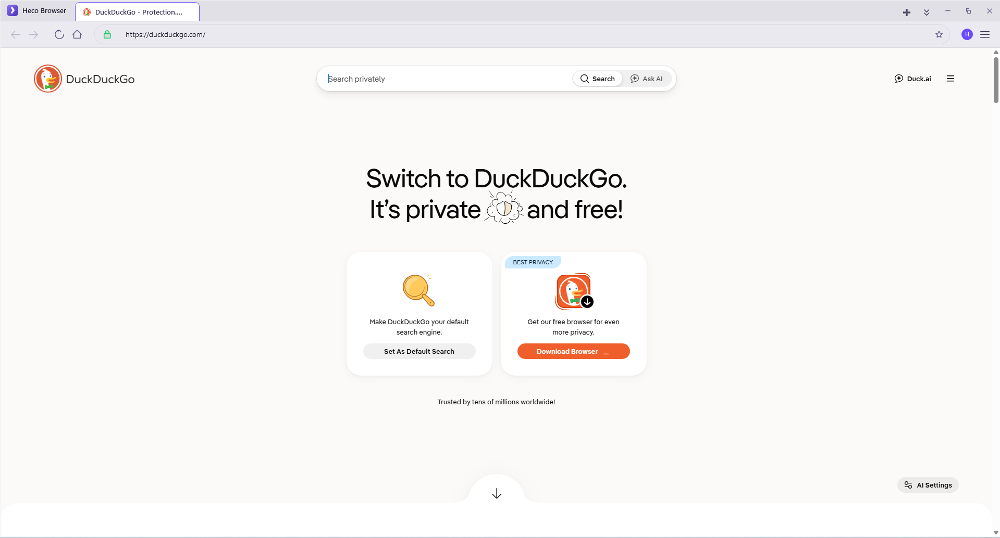
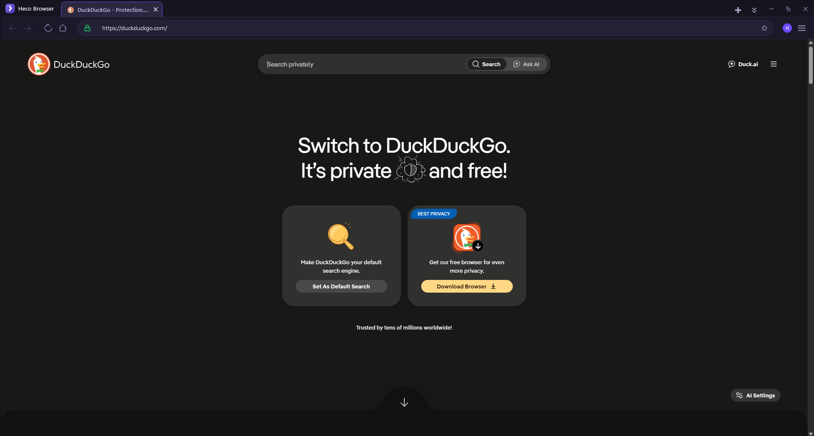

# Heco Browser

|                Light Theme                |               Dark Theme               |
| :---------------------------------------: | :-------------------------------------: |
|  |  |

**Heco Browser** is a fast, modern, and privacy-respecting desktop web browser built for Windows with WPF and the Chromium engine (via [CefSharp](https://github.com/cefsharp/CefSharp)). It pairs a sleek, minimalist interface with genuinely useful productivity features — multi-profile support, guest mode, built-in autofill, a downloads manager, and instant UI localization — so you get a seamless, distraction-free browsing experience.

- Built on **Chromium** for full modern-web compatibility
- **Multi-language** UI that switches instantly, no restart needed
- **Privacy-first** defaults: Do Not Track, third-party cookie blocking, safe-browsing warnings
- **100% local data**: settings, bookmarks, autofill and browsing data stay on your machine

---

## Key Features

### Modern & Customizable UI
- **Sleek interface** — clean, pill-shaped design language with smooth animations and custom popups/toasts built from scratch (no third-party UI kit).
- **Themes** — Light, Dark, or follow your system. The whole UI swaps live via resource dictionaries.
- **Zoom & font size** — set a default page zoom (25% → 200%) and UI font size (12–18) that apply across tabs.

### Fast & Secure Browsing
- **Chromium engine** via CEF — fast page loads and full web standards support.
- **Security indicators** — the address bar shows a clear lock/warning for HTTPS, HTTP, and internal pages, with a site-info popup showing connection and permission details.
- **Privacy controls** — block third-party cookies, send Do Not Track requests, enable Safe Browsing, and warn before visiting sites with invalid certificates.

### Profiles & Guest Mode
- **Multi-profile** — create and switch between independent profiles; each profile keeps its own history, bookmarks and autofill under `%LOCALAPPDATA%\HecoBrowser\Browser\User Data\<profile>`, while the browser **cache is shared** at `User Data\Cache`. (CocCoc-style layout.)
- **Guest mode** — one click for a temporary, fully in-memory session. No history, cookies, or site data are ever written to disk.

### Smart Omnibox & Search
- **Intelligent address bar** — type a URL or search, and get live suggestions from your history, bookmarks, and search engine.
- **Multiple search engines** — DuckDuckGo, Google, Bing, and Brave Search.
- **Find in page** — press `Ctrl + F` to search within the current page.

### Multi-Language Support
- **Instant localization** — switch UI language from Settings and it applies immediately.
- **Supported languages**: English, Vietnamese, Simplified Chinese, French, German, Italian, and Russian.
- **Auto-translate** — optionally route non-Vietnamese pages through Google Translate.

### Productivity Tools
- **Tabs** — open, close, reorder by drag-and-drop, pin (mini icon tabs at the front), duplicate, mute, and reload. Audio-playing tabs show a speaker indicator.
- **Internal App Tabs** — built-in pages like Settings, History, Bookmarks, and Downloads open seamlessly as regular browser tabs for a unified experience.
- **Bookmarks** — save pages with the star button (`Ctrl + D`) or manage them in the Bookmarks view; persisted to JSON.
- **History** — every visited page is grouped intuitively by date and listed in the History view with search filtering. Built-in confirmation dialogues prevent accidental deletions.
- **Download manager** — track progress, open files, and reveal them in Explorer from the Downloads view. Choose a custom download folder or be asked before each save.
- **Data Manager (autofill)** — store and manage passwords, payment cards, and addresses for auto-filling forms.
- **Startup behavior** — start on a fresh tab, restore your last session, or open a fixed set of pages.
- **Run in background** — closing the window keeps Heco running quietly in the system tray (with an icon and menu) until you exit it explicitly.

### Developer-Friendly
- **DevTools** — press `F12` to open Chromium's full developer tools.
- **View source**, **Print**, and a fully **customized right-click context menu** (open link in new tab, copy link/image, save link/image as…).

---

## A Quick Tour of the Interface

- **Title bar** — custom `HecoWindow` frame with the brand name and a **tab strip** below it.
- **Tab strip** — one tab per open page; internal pages (Settings, History, Bookmarks, Downloads) open as their own tabs too. Right-click a tab for pin/mute/duplicate/close actions. Click the chevrons or scroll to browse many tabs, and use the tab-list button to jump anywhere.
- **Toolbar** — Back / Forward / Reload (which turns into Stop while loading), a security icon (site info), the omnibox with autocomplete, a star (bookmark), a zoom indicator, and the **menu (≡)** for History, Bookmarks, Find in page, DevTools, and Preferences.
- **Avatar / profile menu** — toggle Guest Mode or jump to Profile settings.
- **Status area** — a slim loading progress bar under the toolbar while pages load.

---

## Keyboard Shortcuts

| Shortcut | Action |
| --- | --- |
| `Ctrl + T` | New tab |
| `Ctrl + W` | Close current tab |
| `Ctrl + Tab` / `Ctrl + Shift + Tab` | Next / previous tab |
| `Ctrl + 1` … `Ctrl + 8` | Jump to tab 1–8 |
| `Ctrl + 9` | Jump to last tab |
| `Ctrl + L` | Focus the address bar |
| `Ctrl + F` | Find in page |
| `Ctrl + D` | Bookmark / unbookmark current page |
| `Ctrl + H` | Open History |
| `Ctrl + J` | Open Downloads |
| `F5` / `Ctrl + R` | Reload page |
| `Ctrl + +` / `Ctrl + -` / `Ctrl + 0` | Zoom in / out / reset |
| `Alt + ←` / `Alt + →` | Back / forward |
| `F11` | Toggle fullscreen (maximize) |
| `F12` | Developer tools |
| `Esc` | Close find bar / menu |

---

## Privacy & Security

- **Do Not Track** — sends a `DNT: 1` header with every request when enabled.
- **Third-party cookie blocking** — enforced at the Chromium level.
- **Safe browsing / certificate warnings** — you are asked before visiting a site with an invalid security certificate.
- **Native JS dialogs** — `alert`, `confirm`, and `prompt` are rendered with Heco's own window, so malicious sites can't spam native dialogs.
- **Guest mode** — an in-memory session that records nothing to disk.
- **1-click data wipe** — clear history, cookies, cache, and saved data from *Settings → Privacy*.
- **Local data** — everything is stored on your machine (see below). Note: passwords are saved locally in a SQLite `Login Data` file as plaintext (not DPAPI-encrypted like Chrome), so treat it like a regular app password store.

### Where your data lives

Data follows a CocCoc/Chromium-style layout: a `Browser\User Data` folder with a `Local State` metadata file, a **shared `Cache` folder**, and one sub-folder per profile. History, autofill and passwords are stored as **SQLite databases** using Chrome's schema, so they can be inspected with any SQLite browser.

| Data | Location | Format |
| --- | --- | --- |
| Settings | `%APPDATA%\HecoBrowser\settings.json` | JSON |
| `User Data` root (cache + profiles) | `%LOCALAPPDATA%\HecoBrowser\Browser\User Data\` | folder |
| Profile metadata (`Local State`) | `%LOCALAPPDATA%\HecoBrowser\Browser\User Data\Local State` | JSON |
| Shared browser cache & cookies | `%LOCALAPPDATA%\HecoBrowser\Browser\User Data\Cache\` | CEF |
| Default profile folder | `%LOCALAPPDATA%\HecoBrowser\Browser\User Data\Default\` | folder |
| Additional profiles | `%LOCALAPPDATA%\HecoBrowser\Browser\User Data\<ProfileName>\` | folder |
| Browsing history (per profile) | `User Data\<profile>\History` | SQLite (`urls`/`visits`) |
| Bookmarks (per profile) | `User Data\<profile>\Bookmarks` | JSON |
| Autofill — addresses & cards (per profile) | `User Data\<profile>\Web Data` | SQLite (`autofill_profiles`/`credit_cards`) |
| Passwords (per profile) | `User Data\<profile>\Login Data` | SQLite (`logins`) |
| Crash log | `heco-browser-crash.log` (next to the exe) | text |

*Note: the cache (including cookies and site data) is shared across profiles — like CocCoc. Passwords are stored in `Login Data` as plaintext (not DPAPI-encrypted like Chrome), so treat it like a regular app password store.*

---

## Technology & Architecture

| Layer | Technology |
| --- | --- |
| Language | C# (.NET 8) |
| UI framework | WPF (MVVM pattern) |
| Rendering engine | Chromium via **CefSharp.Wpf.NETCore 150** |
| Persistence | SQLite (history/autofill/passwords) + local JSON files |
| Target platform | Windows 10 / 11, **x86** (32-bit, for max CefSharp compatibility) |

The app follows **MVVM** (`MainViewModel`, `ViewModelBase`, `RelayCommand`) with a custom control suite (`HecoButton`, `HecoWindow`, `HecoMessageBox`, `HecoPopup`, `HecoToast`, `HecoJsDialog`, …) and theme switching by swapping merged `ResourceDictionary`s — everything binds with `DynamicResource` so the UI re-themes live.

Browser events are wired through dedicated CEF handlers in `Infrastructure/Handlers/`:

- `RequestHandler` — DNT header injection, certificate error prompts
- `LifeSpanHandler` — `window.open` / `target=_blank` open new tabs instead of new windows
- `ContextMenuHandler` — fully custom right-click menu
- `DownloadHandler` — download tracking + save dialogs
- `JsDialogHandler` — native-feeling alert/confirm/prompt windows
- `KeyboardHandler` — browser-level shortcuts
- `DisplayHandler` (`FaviconHandler`) — per-tab favicons
- `AudioHandler` — per-tab audio indicators & muting

---

## Getting Started

### Requirements
- **Windows 10 or Windows 11** (32-bit or 64-bit — the app itself builds and runs as x86)
- **.NET 8.0 Desktop Runtime** ([download](https://dotnet.microsoft.com/download/dotnet/8.0))

### Build from source
```powershell
# restore packages and build
dotnet build Heco_Browser.slnx

# or open Heco_Browser.slnx in Visual Studio 2022+ and press F5
```
The first build downloads the CefSharp NuGet package (~200 MB) and copies the Chromium binaries into the output folder. Run `Heco.Browser.exe` from `bin\Debug\net8.0-windows\win-x86\`.

### First-time tips
1. Click the **avatar** (right of the address bar) to enable **Guest Mode** or manage **profiles**.
2. Press `Ctrl + ,` or the **menu (≡) → Preferences** to change theme, language, search engine, startup behavior, and more.
3. Star your favorite pages with `Ctrl + D`, then browse them in **Bookmarks**.

---

## Third-Party Licenses

- **[CefSharp](https://github.com/cefsharp/CefSharp)** — BSD-3-Clause. Thank you to the CefSharp team and contributors for making a Chromium-powered WPF browser possible.
- **Chromium** — BSD-style license ([Chromium license](https://www.chromium.org/developers/developers-licenses/)).
- **Microsoft.Xaml.Behaviors.Wpf** — MIT.

---

## License

This project is licensed under the **MIT License** — see the [LICENSE](LICENSE) file for details.
